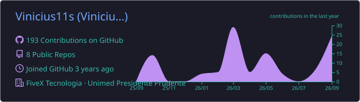
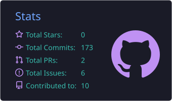
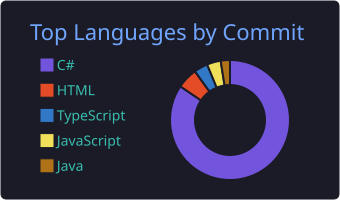

  

<h2> Sobre mim</h2>

<table>
  <tr>
    <td width="44" align="center"></td>
    <td><b>Sócio-proprietário da <a href="https://fivextecnologia.com.br/">FiveX Tecnologia</a></b> — sistemas sob medida, SaaS e automação</td>
  </tr>
  <tr>
    <td align="center"></td>
    <td><b>Infra &amp; DevOps na RaioX Preditivo</b> — responsável por todo o deploy e infraestrutura das plataformas</td>
  </tr>
  <tr>
    <td align="center"></td>
    <td><b>Desenvolvedor na Unimed Presidente Prudente</b> — time de Desenvolvimento &amp; Dados: automações, integrações e sistemas internos</td>
  </tr>
  <tr>
    <td align="center"></td>
    <td><b>Automação com IA</b> — agentes LLM, workflows n8n e integrações (WhatsApp Cloud API, CRMs, ERPs)</td>
  </tr>
  <tr>
    <td align="center"></td>
    <td>Graduando em <b>Sistemas de Informação</b> na Toledo Prudente</td>
  </tr>
</table>

<h2> Projetos em produção</h2>

<table>
  <tr>
    <td width="33%" align="center" valign="top">
       
      
      <h3><a href="https://fivextecnologia.com.br/">FiveX Tecnologia</a></h3>
      
      
Empresa de tecnologia: sistemas web, mobile e automações sob medida.

      <a href="https://fivextecnologia.com.br/">fivextecnologia.com.br ↗</a>
        
    </td>
    <td width="33%" align="center" valign="top">
       
      
      <h3><a href="https://primejuris.com.br/login">PrimeJuris</a></h3>
       
      
Plataforma para advogados. Cuido de todo o deploy.

      <a href="https://primejuris.com.br/login">primejuris.com.br ↗</a>
        
    </td>
    <td width="33%" align="center" valign="top">
       
      
      <h3><a href="https://zapcontrol.com.br/">ZapControl</a></h3>
       
      
Gestão e automação de atendimento no WhatsApp. Cuido de todo o deploy.

      <a href="https://zapcontrol.com.br/">zapcontrol.com.br ↗</a>
        
    </td>
  </tr>
  <tr>
    <td width="33%" align="center" valign="top">
       
      
      <h3><a href="https://satoradar.melhoresferramentas.ai/">Sato Radar</a></h3>
      
      
Plataforma de BI para trading. Cuido de todo o deploy.

      <a href="https://satoradar.melhoresferramentas.ai/">satoradar.melhoresferramentas.ai ↗</a>
        
    </td>
    <td width="33%" align="center" valign="top">
       
      
      <h3><a href="https://app.melhoresferramentas.ai/">Melhores Ferramentas AI</a></h3>
      
      
Todas as ferramentas do trader em um só lugar. Cuido de todo o deploy.

      <a href="https://app.melhoresferramentas.ai/">app.melhoresferramentas.ai ↗</a>
        
    </td>
    <td width="33%" align="center" valign="top">
       
      
      <h3><a href="https://portal.unimedprudente.com.br/credenciamentomedico/">Credenciamento Médico</a></h3>
      
      
Portal de credenciamento médico da Unimed Presidente Prudente.

      <a href="https://portal.unimedprudente.com.br/credenciamentomedico/">portal.unimedprudente.com.br ↗</a>
        
    </td>
  </tr>
</table>

<h2> Stack</h2>

<b>Linguagens &amp; Frameworks</b>

<table>
  <tr>
    <td>&nbsp; C#</td>
    <td>&nbsp; .NET</td>
    <td>&nbsp; TypeScript</td>
    <td>&nbsp; JavaScript</td>
  </tr>
  <tr>
    <td>&nbsp; Node.js</td>
    <td>&nbsp; Next.js</td>
    <td>&nbsp; React</td>
    <td>&nbsp; HTML / CSS</td>
  </tr>
</table>

<b>Infra &amp; DevOps</b>

<table>
  <tr>
    <td>&nbsp; Docker</td>
    <td>&nbsp; Coolify</td>
    <td>&nbsp; Traefik</td>
    <td>&nbsp; Nginx</td>
  </tr>
  <tr>
    <td>&nbsp; Linux</td>
    <td>&nbsp; Cloudflare</td>
    <td>&nbsp; GitHub Actions</td>
    <td>&nbsp; Git</td>
  </tr>
</table>

<b>Dados, Automação &amp; IA</b>

<table>
  <tr>
    <td>&nbsp; PostgreSQL</td>
    <td>&nbsp; Oracle</td>
    <td>&nbsp; n8n</td>
    <td>&nbsp; WhatsApp API</td>
  </tr>
  <tr>
    <td>&nbsp; Claude</td>
    <td>&nbsp; Gemini</td>
    <td></td>
    <td></td>
  </tr>
</table>

<h2> Estatísticas</h2>

  

  
  

  

 

  Automatize o repetitivo, foque no que importa.

